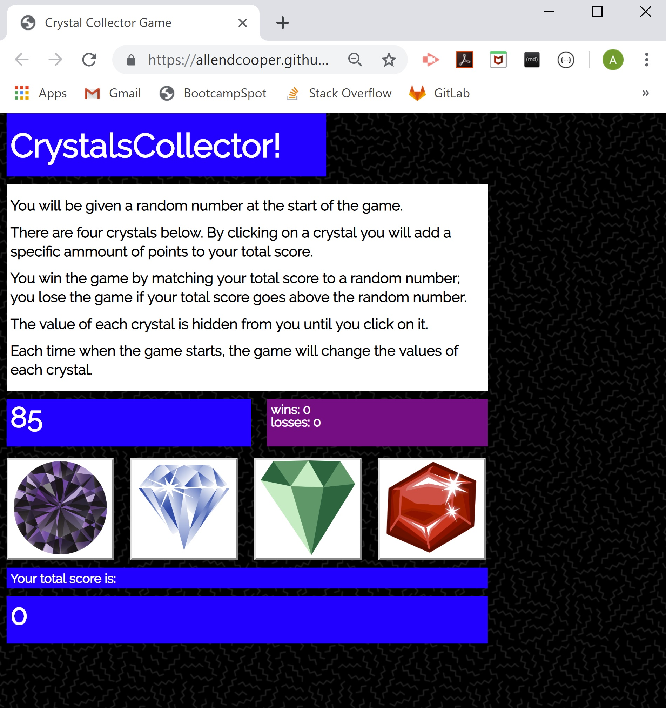

# unit-4-game
CrystalsCollector game using jQuery

[https://allendcooper.github.io/crystals-collector-game/](https://allendcooper.github.io/crystals-collector-game/)

## Overview
* Used jQuery to build a set of functions that do the following: 
    1. create a game object that stores a number of properties, including:
        * wins
        * losses
        * target number to hit
        * values of the 4 jewels
        * user sum
    2. set up a game when the page loads:
        * the game sets up a round
        * the round updates the game object to randomly generate a target number and write it to the document, randomly generates 4 values and assign them to each of the jewels, and sets the user points to 0
    3. update the round when the user clicks on one of the jewel buttons
        * adds the jewels values to the users current points, and writes this value to the document
        * checks to see if the user has won or lost, and if so, set up a new round, and print updated game object to the document
* Built html document with several elements, identified with unique Ids, so that the javascript functions could print to them

* Used CSS to improve design, including adding a Google font and a background image, and reset CSS for cross-browser consistency.

### Functionality
